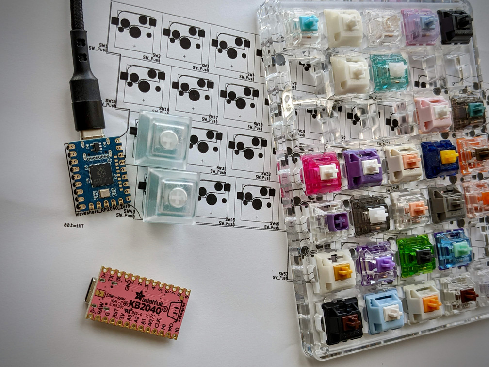
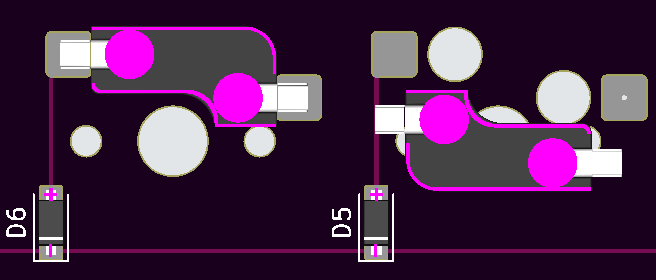

# Purple Owl

The Purple Owl is a uniform row staggered 60% keyboard designed around ortholinear 1u keycaps and hotswap sockets.

## Layout
The Purple Owl was inspired off the works of Ziptyze with their Zlant (4x12) and ZlantXL (5x12). It is almost like a staggered 5-row Preonic but with more columns a narrow bottom row to offer the visual aesthetic of four dominant rows like a Plank. Each row has a 0.25u stagger unlike a traditional row-stagger. There are 14 columns to accommodate the outer symbols (`-=[]\`). The right shift can be traded in for an arrow cluster. The ctrl, shift and other mods are designed to be under the thumbs with a symmetric bottom row that has a 2u surrounded by two 1u on each side. The board runs on RP2040 powered [KMK](http://kmkfw.io/), so the keys can be freely mapped.

Link to the base layout at [Keyboard Layout Editor](http://www.keyboard-layout-editor.com/#/gists/7c51d0df5eb78da5dd614ee6019f13bc). KLE Raw is also available [here](purple-owl-kle.txt)

## Why
I have a gorgeous looking ortho keycap set, MT3 Cyber lying around and it was a shame to not have adorned on a board. I also loved the feel of a shift and ctrl under my left thumb like my setup on the Iris v6, a split column-staggered layout. But, I missed my arrows keys and outer column symbols (which were on a layer). Once, I saw the Zlant - I simply knew I had to make the Purple Owl. Plus, it's been a over a year since I designed a PCB, or worked on a [hobby electronics project](https://github.com/SonalPinto/krz-arduboy2) and wanted to get into something before I forget how to DIY.

## PCB

### Externals
- Acheron MX footprints ([link](https://github.com/AcheronProject/acheron_MXH.pretty.git)) for Kailh hotswap sockets.
- Geometric animals art for the silkscreen ([link](https://www.etsy.com/listing/873524342/geometric-animals-bundle-svg-linear]))
- JLCPCB Tools for Kicad ([link](https://github.com/Bouni/kicad-jlcpcb-tools)) to generate the gerbers and assembly files for JLCPCB.

### Prototype v0.1
To get a feel for the layout I prototyped a board that runs off a RP2040 microcontroller, the Waveshare RP2040 Zero. When I started the prototype, I intended for the the final Purple Owl PCB to have all electronics integrated on the board, including the RP2040. The prototype PCB is simply a diode matrix of hotswap sockets and diodes hooked up to the Zero. No LEDs or anything fancy yet.

I referred to the "recommended minimums" on [Acheron Setup](http://acheronproject.com/acheron_setup/acheron_setup/) for board rules which are more constrained for some fields that the default JLCPCB setup. Laying out the switches is a cakewalk once you set the grid to 19.05mm (1u or 0.75in). For the stagger, set the grid to 4.7625mm (0.25u or 19.05/4mm). The controller is tilted by 26' which is along the ~~z~~slant of the columns.

I checked for clearance pretty early on as soon as I had the swtiches and controller laid out to make sure the slightly tilted controller and USB cable seemed ok on the right side. I printed half(~ish) the layout flipped on paper to scale.

#### JLCPCB Assembly
For assembly, I wanted to trial JLCPCB's assembly service - especially for hotswap sockets. While, I could simply solder the sockets myself, I was curious about JLCPCB's work. And, if it did work, then building the proper Purple Owl would be fairly turnkey.

The footprint for the JLCPCB [part](https://jlcpcb.com/partdetail/Kailh-CPG151101S11/C2803348) for the Kailh hotswap socket is centered around the socket itself. But, the switch footprint on the PCB is centered around the stem hole. So, I wrote a [small python snippet](pcb/tools/fix_pos.py) to fix the socket position and rotation in the POS assembly file. Below, you can see how it looks before (right) and after (left) the fix on the JLCPCB assembly preview.

The cost for the PCB fabrication and assembly came up to $85 for 5 boards assembled. The 305 hotswap sockets (61 per board) going at 78 cents a piece for a total of about $24. In hindsight, I should have just assembled 2 boards considering this was a prototype, but my excitement got the better of me.

#### Firmware
The Zero supports CircuitPython and thus, KMK. So, not much work to be done aside from the KMK config for the matrix. I'd need to add CircuitPython support for the RP2040 layout integrated on the proper Purple Owl (if I went that route), but that seems easy looking at [how it was ported](https://sourcegraph.com/github.com/adafruit/circuitpython/-/tree/ports/raspberrypi/boards/waveshare_rp2040_zero) for the Zero.

### Revelation

A while back, I had considered shift registers for scanning the switch matrix in passing when I had read this [Hackaday article](https://hackaday.com/2018/09/30/whats-the-cheapest-way-to-scan-lots-of-buttons/). Along the lines of using 2 shift registers for an 8x8 matrix - one serial-to-parallel to drive the columns and a parallel-to-serial to poll the rows. While this would use only two 8-bit shift registers, I'd still need diodes per switch for NKRO. However, I'd need no more than 5-6 pins to interface with the switch matrix over the two shift registers. At first glance, the approach didn't really seem any better than using a traditional diode matrix and routing the columns and rows to the IOs of the microcontroller (especially since I was considering integrating the RP2040 on the board).

Then, I stumbled upon an article for the [Hello World Smart Keyboard](https://kbd.news/Hello-Word-Smart-Keyboard-1569.html) project when Dovenyi posted their [#89 issue of the KBD News Digest](https://www.reddit.com/r/MechanicalKeyboards/comments/wdgbuy/keyboard_builders_digest_issue_89/) on r/mk. It was a curiously interesting design with 74HC165 shift registers polling _all_ switches latched in parallel along a 1xN matrix. Surely, this would need a lot of shift registers (one IC per 8 keys) and pull up resistors per switch. So, in terms of parts, the design used relatively more parts (and proper active components). Nonetheless, the most attractive part of the design was that it needed merely 3 pins to interface with the matrix.

While I was running a embarrassingly one-sided rubber ducking session with Dovenyi on that reddit thread, I realized something. Using fewer fins suddenly opens up a design where I can attach off-the-shelf (OTS) microcontroller boards right in between the switches (alongside the hotswap sockets) - underneath the switches and not on the side. Because, I'd only need to solder enough headers for functional and mechanical purpose. I could use something tiny like a [Adafruit QTPy RP2040](https://www.adafruit.com/product/4900) or [Pimoroni Tiny RP2040](https://shop.pimoroni.com/products/tiny-2040?variant=39560012234835) and merely use just one side of the pins between the sockets, and some on the other side for mechanical stability.

These uC (microcontroller) boards are typically 700mil wide with their columns of pins 600mil apart. They don't fit around hotswap sockets. It does work for soldered switch footprints like in the case of ErgoDash or ErgoTravel, but not for hotswap sockets because of the wider footprint. Hence, in the prototype I had the uC on the side. Secondly, the uC boards that have enough pins for a diode matrix are typically longer than 1U and won't fit across the rows of a row-staggered layout (while they do work for ortho or column staggered layouts). Now, these problems are washed out when you realize that you don't need to drill and solder headers for _all_ the pins. Just enough to get the job done. And, you don't really need to use a small board like the QTPy. Even a KB2040 would work - since you don't have to drill holes across the rows to access all the pins.

I had almost gone down the path of designing an integrated RP2040 board. Researched a bunch of popular designs and minimal RP2040 circuits, and printed all their schematics. I had even picked out the parts on LCSC and had calculated the trace widths and separation required for the differential pair routing for the USB Full Speed mode (90ohm Z_diff). Primarily, because I didn't think there was a design I where I could have the uC board underneath and not on the side...

And now, there was a way.

#### Firmware
Looks like KMK has a scanner for shift registers ([see](https://github.com/KMKfw/kmk_firmware/blob/master/kmk/scanners/keypad.py)) that wraps CircuitPython's `keypad.ShiftRegisterKeys()`. Great!

## Credits
- Layout inspired by Ziptyze's [Zlant](https://1upkeyboards.com/shop/keyboard-kits/diy-40-kits/zlant-40-acrylic-keyboard-kit/) and [ZlantXL](https://1upkeyboards.com/shop/keyboard-kits/diy-40-kits/zlantxl-50-mechanical-keyboard-kit/).
- Electronics inspired by Zhihui's [HanWen](https://github.com/peng-zhihui/HelloWord-Keyboard) and Tzarc's [Ghoul](https://github.com/tzarc/ghoul) which use shift registers to scan the matrix.