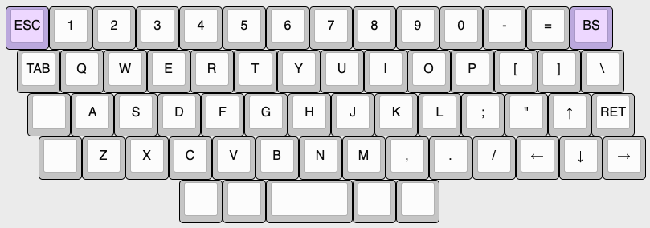
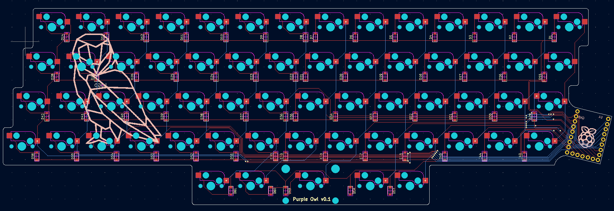

# Purple Owl

The Purple Owl is a uniform row staggered 60% keyboard designed around ortholinear 1u keycaps and hotswap sockets.

## Layout
The Purple Owl was inspired off the works of u/Ziptyze with their Zlant (4x12) and ZlantXL (5x12). It is almost like a staggered 5-row Preonic but with more columns a narrow bottom row to offer the visual aestheic of four dominant rows like a Plank. Each row has a 0.25u stagger unlike a traditional row-stagger. There are 14 columns to accomodate the outer symbols (`-=[]\`). The right shift can be traded in for a must-have arrow cluster. The ctrl, shift and other mods are designed to be under the thumbs with a symmetric bottom row that has a 2u sorrounded by two 1u on each side. The board runs on RP2040 powered [KMK](http://kmkfw.io/), so the keys can be freely mapped.

Link to the base layout at [Keyboard Layout Editor](http://www.keyboard-layout-editor.com/#/gists/7c51d0df5eb78da5dd614ee6019f13bc). KLE Raw is also available [here](purple-owl-kle.txt)

## Why
I have a gorgeous looking ortho keycap set, MT3 Cyber lying around and it was a shame to not have adorned on a board. I also loved the feel of a shift and ctrl under my left thumb like my setup on the Iris v6, a split column-staggered layout. But, I missed my arrows keys and outer column symbols (which were on a layer). Once, I saw Ziptyze's Zlant - I simply knew I had to make the Purple Owl. Plus, it's been a over a year since I designed a PCB, or worked on a [hobby electronics project](https://github.com/SonalPinto/krz-arduboy2) and wanted to get into something before I forget how to solder.

## PCB

### Externals
- Acheron MX footprints ([link](https://github.com/AcheronProject/acheron_MXH.pretty.git)) for Kailh hotswap sockets.
- Geometrtic animals art for the silkscreen ([link](https://www.etsy.com/listing/873524342/geometric-animals-bundle-svg-linear]))
- JLCPCB Tools for Kicad ([link](https://github.com/Bouni/kicad-jlcpcb-tools)) to generate the gerbers and assembly files for JLCPCB.

### Prototype
To get a feel for the layout I prototyped a board that runs off a RP2040 microcontroller, the Waveshare RP2040 Zero. The proper Purple Owl PCB will have all electronics on the board, including the RP2040. The prototype PCB is simply a matrix of hotswap sockets and diodes hooked up to the Zero. No LEDs or anything fancy yet.

I referred to the "recommended minimums" on [Acheron Setup](http://acheronproject.com/acheron_setup/acheron_setup/) for board rules which are more constrained for some fields that the default JLCPCB setup. Laying out the switches is a cakewalk once you set the grid to 19.05mm (1u or 0.75in). For the stagger, set the grid to 4.7625mm (0.25u or 19.05/4mm). The controller is tilted by 26' which is along the slant of the columns.

I checked for clearance pretty early on as soon as I had the swtiches and controller laid out to make sure the slightly tilted controller and USB cable seemed ok on the right side. I printed half(~ish) the layout flipped on paper to scale.

#### JLCPCB Assembly
For assembly, I wanted to trial JLCPCB's assembly service - especially for hotswap sockets. While, I could simply solder the sockets myself, I was curious about JLCPCB's work. And, if it did work, then building the proper Purple Owl would be turnkey.

The footprint for the JLCPCB [part](https://jlcpcb.com/partdetail/Kailh-CPG151101S11/C2803348) for the Kailh hotswap socket is centered around the socket itself. But, the switch footprint on the PCB is centered around the stem hole. So, I wrote a [small python snippet](pcb/tools/fix_pos.py) to fix the socket position and rotation in the POS assembly file. Below, you can see how it looks before (right) and after (left) the fix on the JLCPCB assembly preview.

The cost for the PCB fabrication and assembly came up to $85 for 5 boards assembled. The 305 hotswap sockets (61 per board) going at 78 cents a piece for a total of about $24.

#### Firmware
The Zero supports CircuitPython and thus, KMK. So, not much work to be done aside from the KMK config for the matrix. I'd need to add CircuitPython suport for the RP2040 layout on the proper Purple Owl, but that seems easy looking at [how it was ported](https://sourcegraph.com/github.com/adafruit/circuitpython/-/tree/ports/raspberrypi/boards/waveshare_rp2040_zero) for the Zero.
